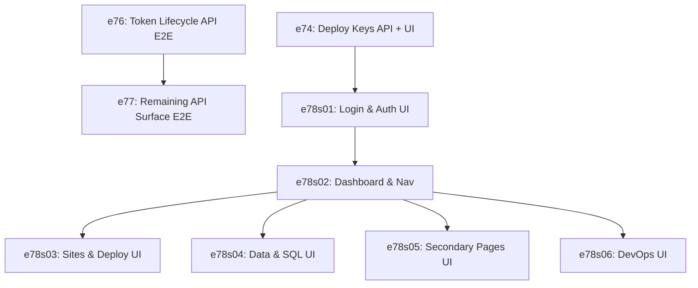

# Harmonious Master Test Plan: BigBase Testing Strategy

> **Scope:** Full-stack unified test architecture covering API units, request-level E2E integration, and browser-level UI coverage across all 22 routes and 17 components.
> **Epics Integrated:** e74 (Deploy Keys), e76 (Token Lifecycle), e77 (API Surface), e78 (Browser E2E UI)
> **Total Target Coverage:** 140 Scenarios, 97 BCPs

---

## 1. Unified Test Architecture Matrix

This matrix outlines how the different testing layers (Unit, API E2E, Browser E2E) interlock to provide full platform protection:

| Epic | Focus Area | Level | Scenarios | BCPs | Primary Target |
|------|------------|-------|-----------|------|----------------|
| **e74** | Deploy keys (`bb_dep_*` CRUD + UI) | API Unit + Browser | 20 | 5 | [apikeys_test.go](file:///Users/danielvm/Developer/bigbase/components/auth/apikeys_test.go), [SiteDeployKeysTab.tsx](file:///Users/danielvm/Developer/bigbase/ui/src/components/SiteDeployKeysTab.tsx) |
| **e76** | Token lifecycle (JWT, refresh, org keys, anon, MCP) | API E2E (Request) | 32 | 20 | [refreshtoken_test.go](file:///Users/danielvm/Developer/bigbase/components/auth/refreshtoken_test.go), `tests/e2e/token-lifecycle.spec.ts` |
| **e77** | Remaining API surface (all 17 components) | API E2E (Request) | 48 | 36 | `tests/e2e/api-surface.spec.ts` |
| **e78** | All UI routes (22 pages, browser-level) | Browser E2E (Page) | 40 (77 scenarios) | 36 | `tests/e2e/` (Chromium UI Specs) |
| **Total** | **Full Platform Coverage** | **Both Layers** | **140** | **97** | **Unified BigBase Test Suite** |

---

## 2. Current State vs. Target State Delta

```
  Current:   3 spec files  →   9 test functions  →   8 API endpoints (request only, 0 page checks)
  Target:   22 spec files  →  89 test functions  →  22 UI routes (browser) + 80 API endpoints (request)
             0 page objects →  13 page objects
             0 fixtures     →   4 fixture files
```

---

## 3. Integrated Risk & Scenario Matrix

### P0 — Critical (Core security, authorization & release-blocking)

| Scenario ID | Epic/Story | Behavior Description | Test Level | Target File/Module |
|-------------|------------|----------------------|------------|--------------------|
| `SC-e74s01-P0-01` | e74s01 | **Generate Key logic** — `CreateSiteKey` produces a valid `bb_dep_*` token and saves its SHA-256 hash. | Unit/Integration | [sitekeys_test.go](file:///Users/danielvm/Developer/bigbase/components/auth/sitekeys_test.go) |
| `SC-e74s02-P0-03` | e74s02 | **E2E Deploy Key Lifecycle** — Complete user deploy key creation, copy, and revocation flow. | Browser E2E | `tests/e2e/deploy-keys-ui.spec.ts` |
| `SC-e76-P0-01` | e76 | **Full session lifecycle** — Register → login → refresh → old token rotation rejection → logout-all invalidation. | API E2E | `tests/e2e/token-lifecycle.spec.ts` |
| `SC-e76-P0-02` | e76 | **Org API key lifecycle** — Generate `bb_*` key → authenticate → revoke → enforce rejection (401). | API E2E | `tests/e2e/token-lifecycle.spec.ts` |
| `SC-e76-P0-05` | e76 | **Refresh token family invalidation** — Detect token replay, revoke all downstream child/family tokens. | API E2E | `tests/e2e/token-lifecycle.spec.ts` |
| `SC-e77-P0-03` | e77 | **Org Isolation** — Ensure Tenant A cannot access or query Tenant B's keys, sites, or memberships. | API E2E | `tests/e2e/api-surface.spec.ts` |
| `SC-e77-P0-06` | e77 | **Full Deploy Pipeline** — Create repo → create site → trigger deploy → check logs/terminal state transitions. | API E2E | `tests/e2e/api-surface.spec.ts` |
| `SC-e78s01-P0-02` | e78s01 | **Successful Login E2E** — Form inputs, submit, cookie set, and transition to dashboard. | Browser E2E | `tests/e2e/login-ui.spec.ts` |
| `SC-e78s03-P0-05` | e78s03 | **Deploy Token UI lifecycle** — Create via tab modal, view once, display in list, copy value, revoke. | Browser E2E | `tests/e2e/deploy-keys-ui.spec.ts` |
| `SC-e78s04-P0-04` | e78s04 | **SQL Editor Execution** — Input queries, click run, view dataset columns/rows in grid. | Browser E2E | `tests/e2e/sql-editor.spec.ts` |

### P1 — High (Common user journeys, validation rules & rate limiting)

| Scenario ID | Epic/Story | Behavior Description | Test Level | Target File/Module |
|-------------|------------|----------------------|------------|--------------------|
| `SC-e74s01-P1-04` | e74s01 | **Rate limiting** — Restrict deploy key creation requests to 10 per hour per site/user. | Integration | [sitekey_handlers_test.go](file:///Users/danielvm/Developer/bigbase/components/auth/sitekey_handlers_test.go) |
| `SC-e76-P1-03` | e76 | **Custom JWT Lifetimes** — Configured lifetimes (`--jwt-access-expiry`) are enforced in generated claims. | API E2E | `tests/e2e/token-lifecycle.spec.ts` |
| `SC-e77-P1-01` | e77 | **Site Env Vars CRUD** — Enforce full CRUD endpoints for environment variables. | API E2E | `tests/e2e/api-surface.spec.ts` |
| `SC-e77-P1-07` | e77 | **Health Check Schema** — `/api/monitoring/health` returns status fields for all active modules. | API E2E | `tests/e2e/api-surface.spec.ts` |
| `SC-e78s01-P1-02` | e78s01 | **Registration form routing** — Renders inputs, handles validations, and auto-logs in. | Browser E2E | `tests/e2e/login-ui.spec.ts` |
| `SC-e78s03-P1-02` | e78s03 | **UI Env Vars Editor** — Render, add, modify, and delete variable keys and values. | Browser E2E | `tests/e2e/sites-ui.spec.ts` |
| `SC-e78s05-P1-03` | e78s05 | **UI Password Reset Form** — Input new password, submit settings form, see success toast. | Browser E2E | `tests/e2e/settings-ui.spec.ts` |

### P2 — Medium (Secondary flows, edge cases & logs)

| Scenario ID | Epic/Story | Behavior Description | Test Level | Target File/Module |
|-------------|------------|----------------------|------------|--------------------|
| `SC-e76-P2-08` | e76 | **Log Redaction** — Verify raw auth/api tokens never appear in server output files. | Unit | Static check |
| `SC-e77-P2-08` | e77 | **Path Traversal Guard** — Storage downloads reject requests containing `../` traversal patterns. | API E2E | `tests/e2e/api-surface.spec.ts` |
| `SC-e78s04-P2-01` | e78s04 | **Data Studio Navigation Link** — Clicking "Query this" forwards the schema type to the SQL query editor. | Browser E2E | `tests/e2e/data-studio.spec.ts` |
| `SC-e78s06-P2-02` | e78s06 | **Monitoring log search** — Input search query/filters, confirm table records filter dynamically. | Browser E2E | `tests/e2e/monitoring-ui.spec.ts` |

### P3 — Low (Visual rendering, empty states & skeletons)

| Scenario ID | Epic/Story | Behavior Description | Test Level | Target File/Module |
|-------------|------------|----------------------|------------|--------------------|
| `SC-e78s03-P3-02` | e78s03 | **Skeleton Renders** — Verify loading skeletons show during API queries. | Browser E2E | `tests/e2e/sites-ui.spec.ts` |
| `SC-e78s06-P3-02` | e78s06 | **Realtime Empty State** — Renders empty room states appropriately. | Browser E2E | `tests/e2e/realtime-ui.spec.ts` |

---

## 3. Fixture Architecture & Isolation Strategy

### 3.1 — Session State Reuse (`storageState`)
To optimize speed and prevent redundant authentication queries during test runs, authenticate once in a global setup project, save state, and inject it into all browser test contexts:
* **Prerequisite Setup**: [auth.setup.ts](file:///Users/danielvm/Developer/bigbase/tests/e2e/auth.setup.ts) runs registration once per worker.
* **Storage state location**: Saved to `tests/e2e/.auth/user.json`.
* **Playwright usage**: Shared config forces `storageState: 'tests/e2e/.auth/user.json'` across Chromium specs.

### 3.2 — Database Sandbox Isolation
* **Server Invocation**: Playwright starts the serving instance using a clean temporary database:
  `BIGBASE_DB=/tmp/bigbase-e2e-browser.db go run . serve --port 9999`
* **Test Isolation**: Tests isolate records using unique email seeds (`e2e-${Date.now()}@test.com`) and run drop-scripts during teardown.

### 3.3 — No External Mocks Rule
* All tests execute against the active BigBase binary server.
* External interfaces (e.g., GitHub webhooks, SMTP email dispatch) are routed to local capture utilities to prevent network drift.

---

## 4. Non-Functional Requirements (NFR)

* **Performance**: Browser E2E test runs must complete within `< 5 minutes` across the 22 routes.
* **Flake Threshold**: Maintain a `< 2%` flake rate. Implement automated retries (max 2 runs) on CI.
* **Clean State**: Ensure complete removal of generated workspaces and deployment directories upon test completion.

---

## 5. Implementation Strategy & Order



1. **Phase 1 (Core Auth & Routing)**: Build `auth.setup.ts` and E2E login/logout routines ([e78s01](file:///Users/danielvm/Developer/bigbase/specs/epics/e78-browser-e2e-coverage/e78s01-spec.md)).
2. **Phase 2 (Navigation Shell)**: Verify route safety gates and sidebar navigation redirects ([e78s02](file:///Users/danielvm/Developer/bigbase/specs/epics/e78-browser-e2e-coverage/e78s02-spec.md)).
3. **Phase 3 (Parallel Route Coverage)**: Build E2E test cases for `e78s03` through `e78s06` concurrently to implement the 77 browser-level scenarios.
